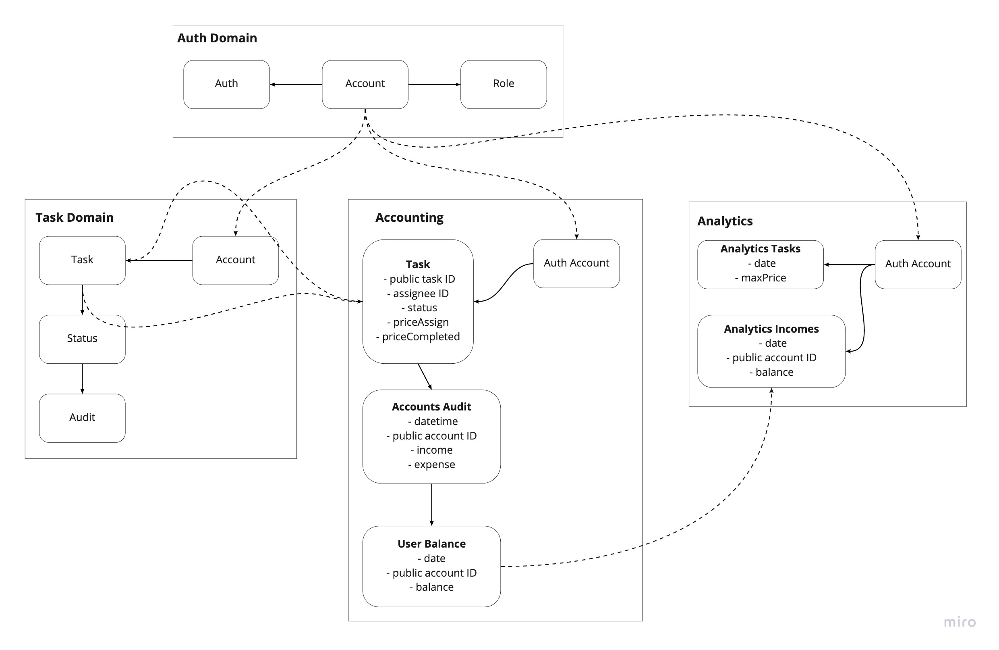

##Services and domains schema

##Business events

| Event | Data | Producer | Consumer(s) |
| ----------- | ----------- | ----------- | ----------- |
| Tasks.Created | Task data | Task service | Accounting service |
| Tasks.Assigned | Task status Assignee public ID | Task service | Accounting service |
| Tasks.Completed | Task status Datetime Actor public ID priceCompleted | Task service | Accounting service Analytics service |
| Accounting.DayBalanceCalculated | Account public ID Day balance | Accounting service (System scheduler) | Accounting service Analytics service |
| Accounting.DayBalanceReset | Account public ID Day balance | Accounting service | Analytics service |

##CUD events

| Event | Data | Producer | Consumer(s) |
| ----------- | ----------- | ----------- | ----------- |
| Tasks.Created | Task data | Task service | Accounting service |
| Tasks.Completed |  Task status Datetime Actor public ID priceCompleted | Task service | Accounting service Analytics service |
| Tasks.PricesCalculated | Public task ID priceAssign priceCompleted | Accounting service | Task service |
|   | Account | Login | Account |